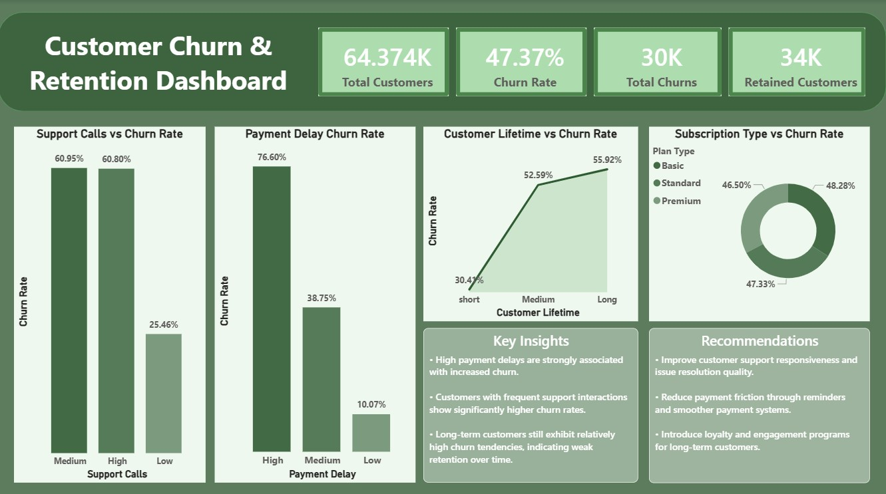

# Customer Churn & Retention Dashboard

## Project Overview

This project focuses on analyzing customer churn patterns and identifying the key factors influencing customer retention in a subscription-based business. The analysis was performed using Python for data preprocessing and Power BI for dashboard creation and visualization.

The dashboard highlights major churn drivers, customer lifetime trends, retention risks, and actionable business recommendations to help reduce customer loss.

---

## Objectives

* Analyze customer churn behavior
* Identify key churn drivers
* Study customer retention trends
* Provide business insights and recommendations
* Build an interactive retention analysis dashboard

---

## Tools & Technologies Used

* Python (Pandas)
* Power BI
* CSV Dataset
* Jupyter Notebook

---

## Key Analysis Performed

### Churn Drivers

* Support Calls vs Churn Rate
* Payment Delay vs Churn Rate
* Subscription Type vs Churn Rate

### Retention Trends

* Customer Lifetime vs Churn Rate

### KPI Metrics

* Total Customers
* Churn Rate
* Total Churns
* Retained Customers

---

## Key Insights

* High payment delays are strongly associated with increased churn.
* Customers with frequent support interactions show significantly higher churn rates.
* Long-term customers still exhibit relatively high churn tendencies, indicating weak retention over time.

---

## Recommendations

* Improve customer support responsiveness and issue resolution quality.
* Reduce payment friction through reminders and smoother payment systems.
* Introduce loyalty and engagement programs for long-term customers.

---

## Files Included

* `cleaned_churn_data.csv` – Cleaned dataset used for analysis
* `churn analysis.pbix` – Power BI dashboard file
* `churn_analysis.jpg` – Dashboard preview image

---

## Dashboard Preview



---

## Repository Structure

```text
FUTURE_DS_02/
│
├── cleaned_churn_data.csv
├── Customer_Churn_Dashboard.pbix
├── dashboard_screenshot.jpg
└── README.md
```

---

## Conclusion

This project demonstrates how data analytics and visualization can help businesses identify churn risks, improve customer retention strategies, and support data-driven decision-making.
